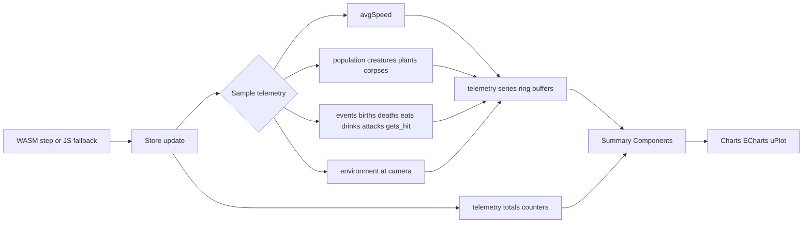

# EvoSim Telemetry

Last updated: 2025-08-23

This document describes telemetry fields produced by the simulation store, their sampling cadence, retention, and which UI components consume them.

Source: `src/composables/useSimulationStore.ts`

## Storage Structure

Telemetry is maintained in a reactive object with ring-buffed numeric arrays and cumulative counters:

- `telemetry.series`
  - `avgSpeed: number[]`
  - `population: { creatures: number[]; plants: number[]; corpses: number[] }`
  - `events: { births: number[]; deaths: number[]; eats_plant: number[]; eats_corpse: number[]; drinks: number[]; attacks: number[]; gets_hit: number[] }`
  - `environment: { temperatureC: number[]; humidity01: number[]; precipitation01: number[]; uv01: number[]; visibility01: number[]; windSpeed: number[] }`
- `telemetry.totals`
  - `births, deaths, eats_plant, eats_corpse, drinks, attacks, gets_hit`

## Sampling Cadence and Retention

- Sampling occurs once per outer update call after each simulation step (`wasmWorld.step(dt)` or JS fallback):
  - `avgSpeed` from `movementStats.avgSpeed`
  - Population counts from lengths of `creatures`, `plants`, `corpses`
  - Event series sample the current cumulative counters in `telemetry.totals`
  - Environment values sampled at the camera center via `sampleWeather(camera.x, camera.y)`
- Retention: each series is capped to `MAX_SERIES = 3600` samples using a ring-buffer splice (oldest values dropped).
- Event series are cumulative snapshots; UI diffs adjacent samples to derive per-interval rates.

## Counter Increments (examples)

- `telemetry.totals.births++` on spawn paths (WASM `spawn_creature()` success or JS fallback)
- `telemetry.totals.deaths++` on death events (e.g., during step integration)
- `telemetry.totals.eats_plant++`, `eats_corpse++`, `drinks++`, `attacks++`, `gets_hit++` incremented when inferred from state deltas and proximity checks

## Consumers in UI

- `src/components/summary/PopulationDynamics.vue`
  - Uses `telemetry.series.population` (creatures, plants, corpses)
  - Windowing and smoothing for stacked area chart
- `src/components/summary/MovementActivity.vue`
  - Uses `telemetry.series.avgSpeed` and `simulationParams.movementThreshold`
  - Renders histogram and line charts
- `src/components/summary/BehaviorEvents.vue`
  - Diffs `telemetry.series.events.*` to per-interval rates
  - Displays per-event charts
- `src/components/summary/ComparisonsTrends.vue`
  - Uses `avgSpeed`, `population.creatures`, and per-interval `births`/`deaths`
  - Smoothing toggle and window selection
- `src/components/summary/HeaderKpis.vue`
  - Displays `generation`, `movementStats.avgSpeed`, population counts (from current arrays), world time, generation duration, `stagnantTicks`
- `src/components/summary/SpatialEnvironment.vue`
  - Uses `store.sampleTerrain()` and scatter overlay rather than telemetry arrays; relevant to environment visualization but not directly a consumer of `telemetry.series.environment`
- `src/components/summary/ExportsBar.vue`
  - Uses generation and other store state for filenames and exports; not a direct consumer of telemetry series

## Notes for Extending Telemetry

- Add new fields to `telemetry.series` and sample them in the update block alongside existing pushes.
- If new counters are introduced, expand `telemetry.totals` and ensure summary components diff the cumulative series.
- Keep `MAX_SERIES` in mind; heavy sampling may need downsampling or adaptive cadence.
- Prefer numeric primitives; sanitize to `0` for `NaN`/`Infinity` before pushing to series.

## Pipeline Diagram

The high-level data flow from simulation step to rendered charts:

Notes:

- Event charts use diffs of cumulative event series to display per-interval rates.
- `MAX_SERIES = 3600` caps the arrays; oldest samples are dropped.

## Component → Telemetry Mapping

- PopulationDynamics.vue
  - Uses: `series.population.creatures`, `series.population.plants`, `series.population.corpses`
- MovementActivity.vue
  - Uses: `series.avgSpeed`; references `simulationParams.movementThreshold`
- BehaviorEvents.vue
  - Uses: `series.events.births/deaths/eats_plant/eats_corpse/drinks/attacks/gets_hit` (diffed)
- ComparisonsTrends.vue
  - Uses: `series.avgSpeed`, `series.population.creatures`, diffed `series.events.births/deaths`
- HeaderKpis.vue
  - Uses: instantaneous counts from `creatures/plants/corpses` arrays and `movementStats.avgSpeed`
- EnvironmentSummary.vue
  - Uses: environment signals and params; exports via `EChart`
